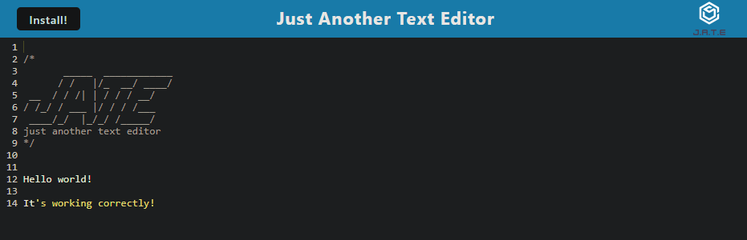

# Text Editor
A text editor that runs in the browser

## Description

This is a text editor that uses PWA structure. It can be installed locally as an app on your computer, and saves all your text even when you're offline!

## Links

- GitHub Repository: https://github.com/blakeedwards3/text-editor
- Link to application: https://still-taiga-16052-680f52c76b64.herokuapp.com/

- 

## Usage

- Navigate to the root folder and run "npm install" and "npm start"
- Install the app locally, or use in the browser

## Credits

Below is a list of a few resources I used to help complete the assignment and better understand what the code is doing.
- The PWA mini project from the UNCC coding bootcamp helped a lot!
- AskBCS helped with debugging issues
- https://www.freecodecamp.org/news/progressive-web-apps-101-the-what-why-and-how-4aa5e9065ac2/